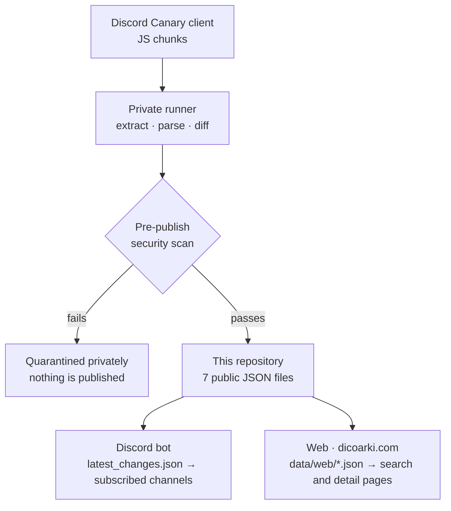

# Discord Datamining

Automated change tracking for the Discord client. A private runner extracts Discord Canary client
chunks on a schedule, diffs each build against the previous state, and publishes what changed —
experiments, localized strings and REST API routes — as seven JSON files in this repository.

Browse the data at **[dicoarki.com/datamining](https://dicoarki.com/datamining)**.

> **This repository is published output, not source code.**
> Every data commit here is written by the runner, not by hand. The only files a human edits are
> `README.md` and the two documents in `docs/`. The runner itself — its parsers, scanners, allowlists
> and tests — lives in a separate private repository and is never published here.

## What is in here right now

These badges read [`data/web/meta.json`](data/web/meta.json) directly, so they always reflect the most
recently published build. No count is hard-coded in this file, and `meta.json` also carries the build
hash, generation time and schema version that the datasets below were produced with.

## How it works

1. **Extract** — the runner pulls the current Canary build's client chunks on a schedule.
2. **Diff** — parsed experiments, strings and routes are compared against the previously stored
   state, so only real changes are recorded.
3. **Scan** — candidates are written to an ignored directory first and checked for secrets, tokens,
   live webhooks, Discord snowflakes and mentions, contact data, forbidden private paths and JSON
   integrity. A failed candidate is quarantined privately and never reaches this repository.
4. **Publish** — only the seven generated paths are staged, every blob is re-verified against the
   scanned candidate, and the push names the exact verified commit.
5. **Consume** — the bot reads `latest_changes.json` to notify subscribed channels; the website
   reads `data/web/*.json` for its search and detail pages.

The publication boundary is described in [`docs/SECURITY_PRIVACY.md`](docs/SECURITY_PRIVACY.md), and
what may or may not be published is listed in [`docs/DATA_INVENTORY.md`](docs/DATA_INVENTORY.md).

## Published files

| File | Contents | Consumed by |
| --- | --- | --- |
| [`data/latest_changes.json`](data/latest_changes.json) | The newest build's diff only: new, modified and deleted experiments, API routes and strings, plus `build_hash` and `extractor_version` | Discord bot |
| [`data/web/meta.json`](data/web/meta.json) | Build hash, generation time, schema version and dataset counts | Web |
| [`data/web/experiments.json`](data/web/experiments.json) | Experiment records — `id`, `experiment_type`, `kind`, `treatments`, `config_keys`, `variations`, `status`, `timestamp` | Web (list, search) |
| [`data/web/experiment-details.json`](data/web/experiment-details.json) | Byte-for-byte identical to `experiments.json`; it is the file the per-experiment detail view and the sitemap read (see *Design notes*) | Web (detail pages, sitemap) |
| [`data/web/apis.json`](data/web/apis.json) | REST route records — `name`, `url`, `old_url`, `status`, `timestamp` | Web |
| [`data/web/strings.en.json`](data/web/strings.en.json) | Localized string records — `key`, `lang`, `value`, `status`, `timestamp` | Web |
| [`data/web/strings.ko.json`](data/web/strings.ko.json) | Same shape, Korean locale | Web |

Records are history entries, not current-state rows: a key that changed twice appears twice, with
`old_value` retained on modifications.

## Design notes

- **The pre-publish scan is the privacy boundary, not this repository.** Deleting a file from a
  public repository does not erase it from Git history, so anything that must never be public has to
  be stopped before a commit exists.
- **The public file set is fixed at exactly eleven paths, enforced by a pre-push hook.** Each
  commit's tree must match that set exactly — additions *and* deletions fail the push. Runner code,
  scanners, allowlists, tests, CI workflows and internal reports cannot land here by accident.
- **The published JSON is a cross-repository contract.** The bot and the website read these files
  directly, so new fields are added as optional and existing fields keep their meaning.
- **History is a log.** Past records are appended; a later build changing state does not rewrite what
  was already recorded.
- **Experiment type is explicit.** Apex experiments are identified by `experiment_type == "apex"`,
  never inferred from treatment names.

- **`experiments.json` and `experiment-details.json` hold the same rows on purpose.** Until schema
  version 5 the detail file was a filtered subset — only the experiments that carried
  `analysis`, `default_config`, `variations` and friends — while the list file was summary-only.
  Schema 7 merged them, because both halves of the site need the full-fat records: the list view
  filters and badges experiments by their interpretation, and every experiment (not just an
  annotated one) needs a reachable detail page. The runner writes both files from one list and
  refuses to publish if their interpretation payloads ever drift apart, so a consumer may treat
  either file as the complete experiment history. `meta.json` reports both counts:
  `counts.experiment_details` is that shared row count, and `counts.experiment_detail_summaries`
  is the smaller number of rows that actually carry detail fields — a statistic, not the size of
  any published file.

## 한국어 요약

이 저장소는 **Discord 클라이언트의 변경 사항을 자동으로 추적한 결과물**입니다. 비공개 러너가 주기적으로
Canary 클라이언트 chunk를 추출해 이전 상태와 비교하고, 실험(Experiments) · 문자열(Strings) · REST API
엔드포인트의 변경을 JSON 7개로 발행합니다. 데이터를 편하게 보려면
[dicoarki.com/datamining](https://dicoarki.com/datamining)을 이용하세요.

- **이 저장소의 커밋은 전부 자동 생성입니다.** 사람이 직접 편집하는 파일은 `README.md`와 `docs/` 문서
  두 개뿐이며, 러너 코드·검사기·테스트는 별도의 비공개 저장소에 있습니다.
- **발행 전 보안 검사가 프라이버시 경계입니다.** 공개 Git 이력은 파일을 지워도 남기 때문에, 공개되면
  안 되는 것은 커밋이 생기기 전에 막습니다. 검사에 실패한 산출물은 발행하지 않고 비공개로 격리합니다.
- **공개 파일 집합은 11개로 고정돼 있고 pre-push 훅이 강제합니다.** 파일 추가와 삭제 모두 push가 막힙니다.
- **발행되는 JSON은 저장소 경계를 넘는 공개 인터페이스입니다.** 봇과 웹이 직접 읽으므로 새 필드는
  optional로만 추가하고, 기존 필드의 의미는 바꾸지 않습니다.
- **History는 로그입니다.** 이후 빌드에서 상태가 바뀌어도 이미 기록된 항목을 덮어쓰지 않습니다.
- **`experiments.json`과 `experiment-details.json`은 의도적으로 같은 내용입니다.** schema 5까지는 상세
  필드를 가진 실험만 추린 부분집합이었지만, 목록 화면이 해석(analysis) 유무로 필터링해야 하고 주석이
  없는 실험에도 상세 페이지가 있어야 해서 schema 7에서 하나로 합쳤습니다. 러너가 두 파일을 같은
  목록에서 쓰고 해석 payload가 어긋나면 발행을 중단하므로, 어느 쪽을 읽어도 전체 실험 기록입니다.
  `meta.json`의 `counts.experiment_detail_summaries`는 상세 필드를 가진 행 수를 나타내는 통계값이며,
  발행되는 파일의 크기가 아닙니다.

## Disclaimer and license

This is an unofficial project with no affiliation to, endorsement by, or support from Discord Inc.
Some of the material surfaced by this analysis may remain the property of Discord. Everything here
exists for studying and analyzing data structures. Please do not repost it elsewhere as your own
discovery; when citing it, follow the Creative Commons Attribution-ShareAlike licence (CC BY-SA).

### 주의 사항

이 저장소는 디스코드 본사(Discord Inc.)와 전혀 무관하게 운영되는 비공식 공간입니다. 디스코드의 공식적인
승인이나 지원을 받지 않은 프로젝트이며, 분석 과정에서 수집된 일부 코드의 권리는 디스코드 측에 있을 수
있음을 미리 알립니다.

이곳에 기록된 모든 데이터는 순수하게 데이터 구조를 공부하고 분석하기 위한 용도로만 존재합니다. 노력이
담긴 결과물이므로, 이곳의 자료를 다른 SNS 또는 커뮤니티에 마치 자신이 직접 발견한 것처럼 퍼가는 일은
삼가주세요. 이를 존중하여 인용 시 크리에이티브 커먼즈 라이선스(Creative Commons License)
저작자표시-동일조건변경허락(CC BY-SA)을 따라주세요.
